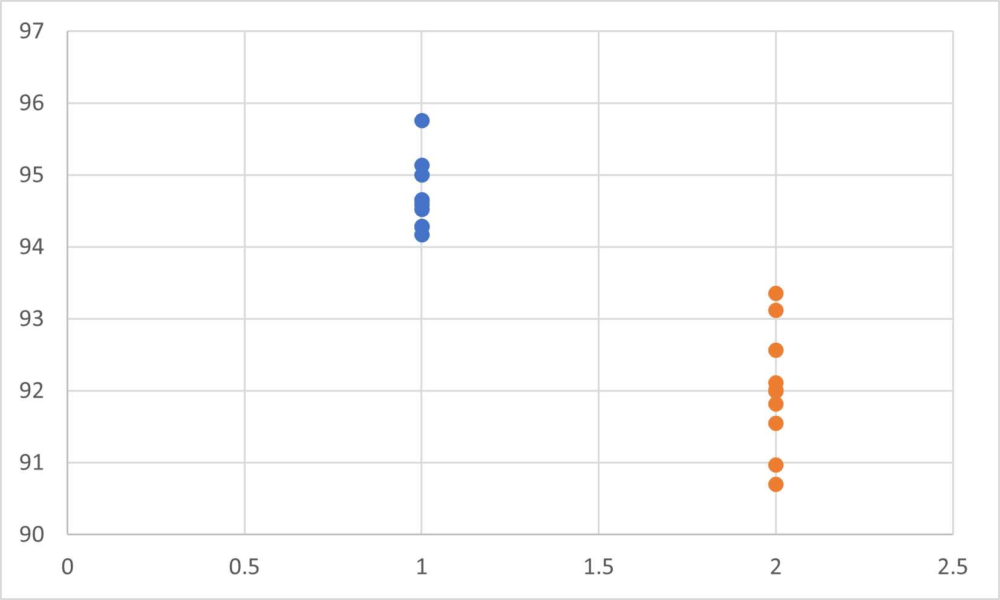

# PyTorch.Improve.Speed
PyTorch에서 학습 속도를 올릴 수 있는 방법에 대해 알아보고, 실험적으로 속도 증가를 확인합니다.


# 실험 환경
```
CUDA:   12.2 (535.86.05)
CPU:    11th Gen Intel(R) Core(TM) i9-11900K @ 3.50GHz
RAM:    64GB(16 x 4),   3200 MT/s,  DARM, 
SSD:    WD WD_BLACK Gen4 SDCPNRY-1T00-1106 [1.02 TB]
GPU:    NVIDIA GeForce RTX 3090, 250W limit

python: 3.10.0
torch:  2.0.1
torchvision:    0.15.2

MNIST
```

# test01
* BatchNorm + Conv (biased) vs BatchNorm + Conv (unbiased)
* <a href="https://tutorials.pytorch.kr/recipes/recipes/tuning_guide.html#disable-bias-for-convolutions-directly-followed-by-a-batch-norm">여기</a>에 따르면, BatchNorm 바로 뒤에 Conv 연산이 올 경우, Conv의 bias term이 True이든 False이든 동일하다고 함.
* torchvision에서 가지고 온 모델의 경우, 이미 BatchNorm 다음에 나오는 Conv 연산에서 unbiased라고 함.
<figure>
    
    <figcaption>
    조건에 따라 10회 실행 시간 <br>
    푸른색: BatchNorm + Conv (biased) <br>
    주황색: BatchNorm + Conv (unbiased)
    </figcaption>
</figure>

# test02
* <a href="https://tutorials.pytorch.kr/recipes/recipes/tuning_guide.html#enable-async-data-loading-and-augmentation">문서</a>
* DataLoader에서 num_workers와 pin_memory에 따른 성능 향상
* num_workers가 0인 경우(default), sync 모드로 동작되기 때문에 느리다고 함.

# test03
* <a href="https://tutorials.pytorch.kr/recipes/recipes/tuning_guide.html#disable-gradient-calculation-for-validation-or-inference">문서</a>
* validation이나 test에서 torch.no_grad()가 있으면, grad 계산을 안 하기 때문에 빠르다고 함.
